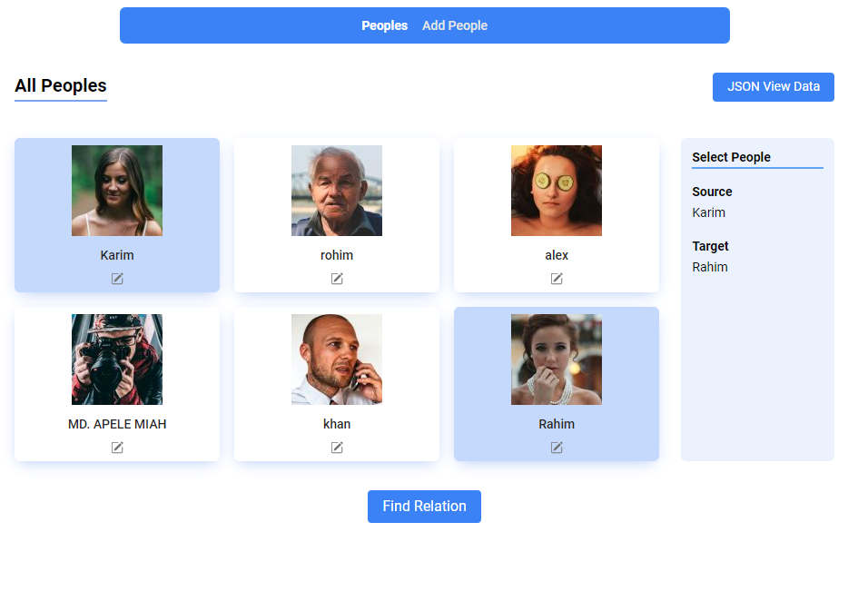
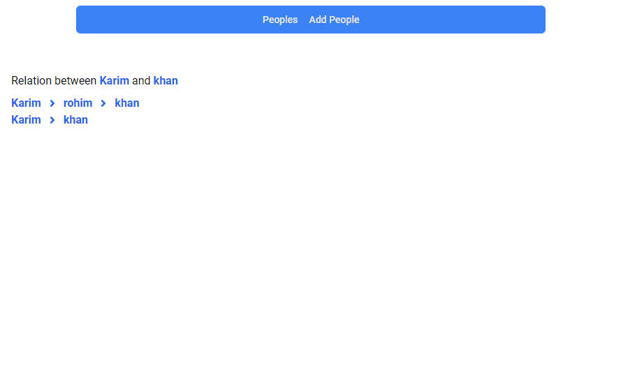
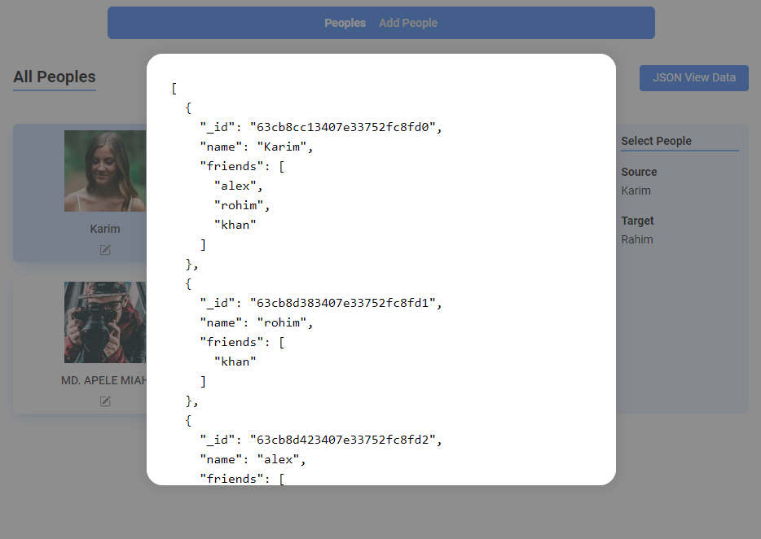
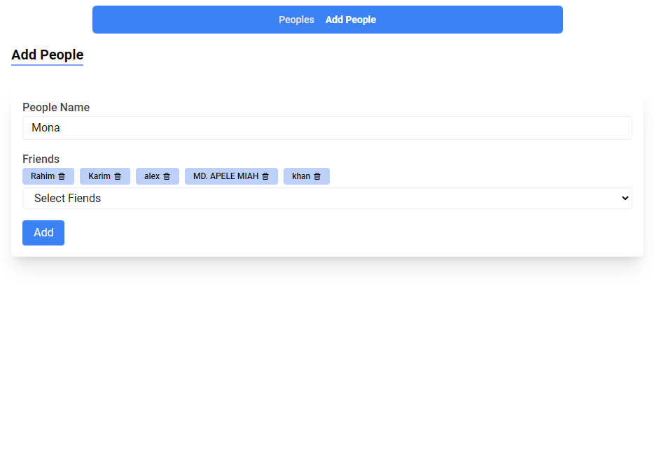

## Relation Finder

#### Live: https://relationship-finder.netlify.app
#### Code: https://github.com/rasel-mahmud-dev/relationship-client

```json
[{
    "_id": "63cb8cc13407e33752fc8fd0",
    "name": "Karim",
    "friends": [
      "alex",
      "rohim",
      "khan"
    ]
  },
  {
    "_id": "63cb8d383407e33752fc8fd1",
    "name": "rohim",
    "friends": [
      "khan"
    ]
  }]
```

Source: Karim, Target: khan

The degree of separation:
Output:  \
Karim > rohim > khan \
Karim > khan


## Uses 
- Typescript
- Reactjs
- Tailwindcss
- Jest (testing)




